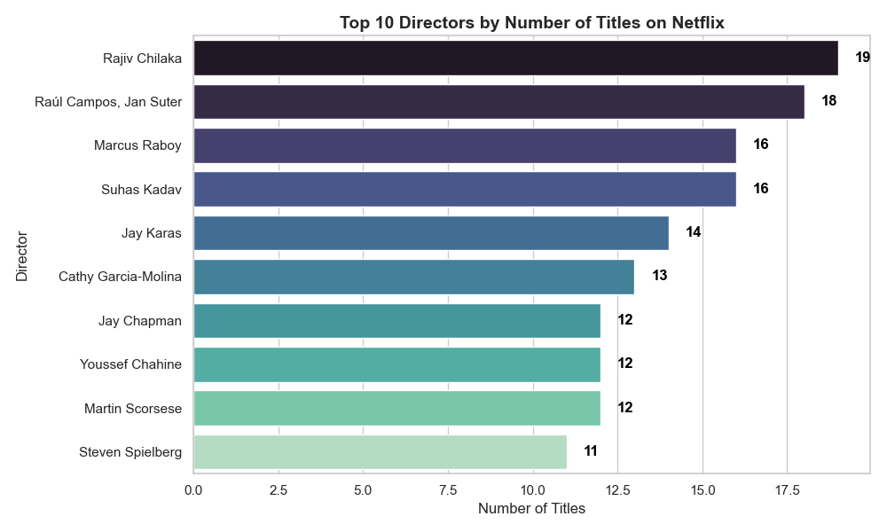
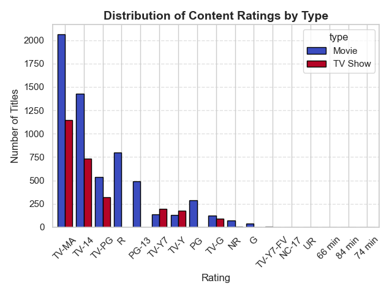
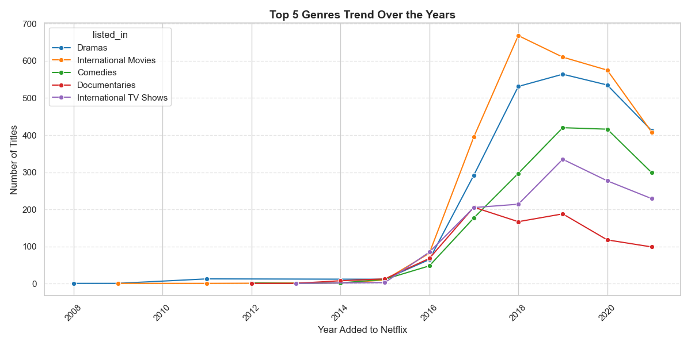
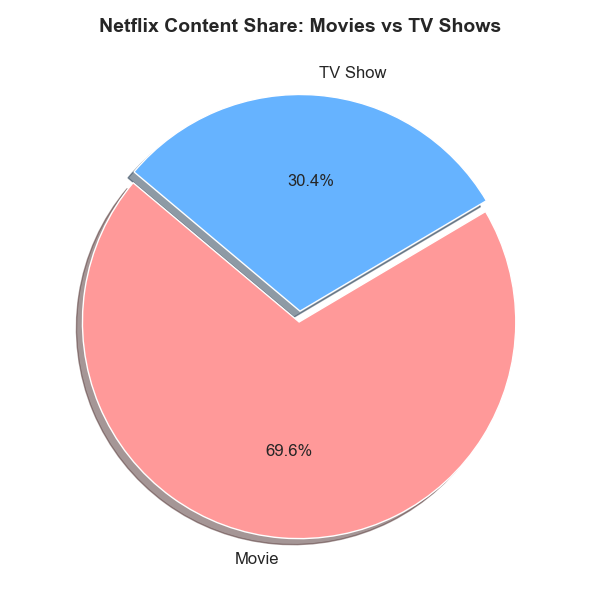

# 📊 Netflix Data Visualization – CodeAlpha Internship Task

This repository contains my submission for **Data Visualization** as part of the **CodeAlpha Data Analytics Virtual Internship**.

---

## 📁 Dataset

- Source: [Netflix Titles Dataset – Kaggle](https://www.kaggle.com/datasets/shivamb/netflix-shows)
- Description: Contains details on 8,800+ Netflix movies and TV shows, including genre, director, rating, and release year.

---

## 🛠 Tools & Libraries Used

- Python
- Pandas
- Matplotlib
- Seaborn

---

## 📌 Project Goals

✔ Transform raw Netflix data into clean visual insights  
✔ Build storytelling visuals around trends, genres, and content types  
✔ Make professional-quality plots for portfolio presentation  
✔ Save and share visuals with GitHub structure

---

## 📈 Visualizations Created

### 🔹 1. Top 10 Directors by Number of Titles
  
**Insight:** Rajiv Chilaka and Raul Campos top the list with the most directed titles on Netflix.

---

### 🔹 2. Distribution of Content Ratings by Type
  
**Insight:** TV-MA and TV-14 dominate, especially in TV shows, while movies also cluster around PG and R ratings.

---

### 🔹 3. Genre Trend Over the Years
  
**Insight:** Dramas, comedies, and international content surged post-2016 as Netflix rapidly expanded globally.

---

### 🔹 4. Netflix Content Share: Movies vs TV Shows
  
**Insight:** Roughly 70% of Netflix's catalog consists of movies, with the rest being TV shows.

---

## 🏁 Internship Details

**Internship Name:** Data Analytics Internship  
**Organization:** [CodeAlpha](https://www.codealpha.tech/)  
**Task:** Data Visualization (Task 3 of 4)  
**Status:** ✅ Completed and Submitted

---

## 📬 Connect With Me

- 🔗 [LinkedIn](https://www.linkedin.com/in/sushant-chaudhary-aa062a231)
- 💻 [GitHub Profile](https://github.com/sush8471)
